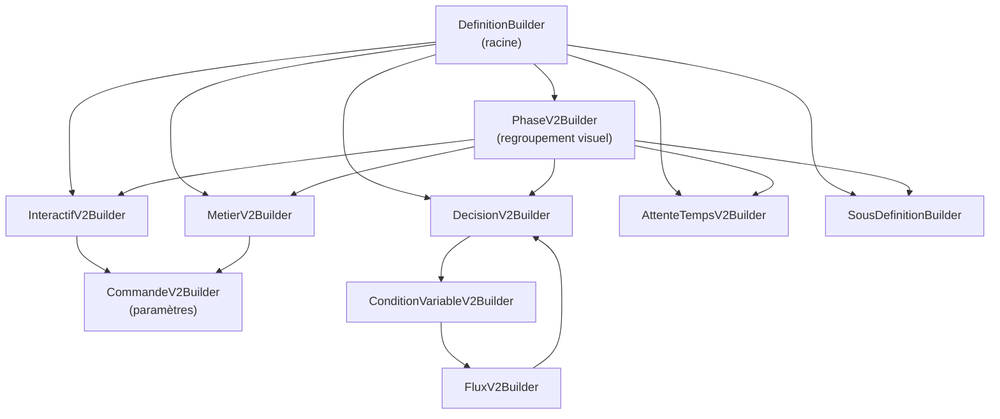

# Builders — référence de la DSL de définition de processus

Ce document est la **référence dédiée aux builders** de BpmPlus : les classes fluides du namespace `BpmPlus.Core.Definition` qui servent à écrire une `DefinitionProcessus` en C#.

- Pour le guide fonctionnel complet (installation, handlers, instances, signaux…) → [GuideUtilisation.md](GuideUtilisation.md)
- Pour le contrat technique du moteur (tables, exécution, interfaces) → [Specifications.md](Specifications.md)

Toutes les classes décrites ici sont définies dans un fichier unique :
[`src/BpmPlus.Core/Definition/DefinitionBuilder.cs`](src/BpmPlus.Core/Definition/DefinitionBuilder.cs).

---

## Table des matières

1. [Vue d'ensemble](#1-vue-densemble)
2. [`DefinitionBuilder` — point d'entrée](#2-definitionbuilder--point-dentrée)
3. [`PhaseV2Builder` — regroupement par phases](#3-phasev2builder--regroupement-par-phases)
4. [`MetierV2Builder` — nœud métier](#4-metierv2builder--nœud-métier)
5. [`InteractifV2Builder` — tâche humaine](#5-interactifv2builder--tâche-humaine)
6. [`DecisionV2Builder` — passerelle de décision](#6-decisionv2builder--passerelle-de-décision)
7. [`AttenteTempsV2Builder` — attente de temps](#7-attentetempsv2builder--attente-de-temps)
8. [Attente de signal — sans builder dédié](#8-attente-de-signal--sans-builder-dédié)
9. [`SousDefinitionBuilder` — sous-processus](#9-sousdefinitionbuilder--sous-processus)
10. [`CommandeV2Builder` — jeux de paramètres](#10-commandev2builder--jeux-de-paramètres)
11. [`Src` — sources de paramètres](#11-src--sources-de-paramètres)
12. [Conventions de nommage automatiques](#12-conventions-de-nommage-automatiques)
13. [`PatternApprobation` — patron prêt à l'emploi](#13-patternapprobation--patron-prêt-à-lemploi)
14. [Les trois formes de `Build`](#14-les-trois-formes-de-build)
15. [Export Mermaid](#15-export-mermaid)
16. [Pièges connus](#16-pièges-connus)
17. [Exemple complet](#17-exemple-complet)
18. [Aide-mémoire](#18-aide-mémoire)

---

## 1. Vue d'ensemble

La DSL est une hiérarchie de builders : un builder racine (`DefinitionBuilder`) qui accumule des nœuds, et un builder spécialisé par type de nœud, configuré dans une lambda.



| Builder | Rôle | Produit |
|---------|------|---------|
| `DefinitionBuilder` | Racine : métadonnées, nœud de début, assemblage | `DefinitionProcessus` |
| `PhaseV2Builder` | Regroupe visuellement des nœuds — **aucun effet runtime** | — (délègue au parent) |
| `MetierV2Builder` | Nœud exécutant une commande | `NoeudMetier` |
| `InteractifV2Builder` | Tâche humaine, suspension de l'instance | `NoeudInteractif` |
| `DecisionV2Builder` | Aiguillage conditionnel | `NoeudDecision` |
| `AttenteTempsV2Builder` | Attente d'une échéance | `NoeudAttenteTemps` |
| `SousDefinitionBuilder` | Appel d'un processus enfant | `NoeudSousProcessus` |
| `CommandeV2Builder` | Jeu de paramètres d'une commande / query | `DefinitionCommande` |
| `ConditionVariableV2Builder` | Condition fluide sur une variable | `ConditionVariable` |
| `FluxV2Builder` | Destination d'une branche (`.Aller` / `.Terminer`) | `FluxSortant` |

**Principe commun à tous les builders de nœud :**

| Méthode | Effet |
|---------|-------|
| `.Puis(id)` / `.Vers(id)` | Ajoute un flux sortant vers `id` (les deux sont strictement équivalents) |
| `.Final()` | Marque le nœud comme final (`EstFinale = true`) — l'instance se termine ici |

> **Important :** hors nœud décision, le moteur ne consomme que **le premier** flux sortant (`FluxSortants.FirstOrDefault()`). Appeler `.Puis(…)` deux fois sur un nœud métier n'ouvre pas deux chemins : le second flux est ignoré à l'exécution mais reste visible dans le diagramme Mermaid. Pour brancher, utilisez un nœud décision.

---

## 2. `DefinitionBuilder` — point d'entrée

```csharp
using BpmPlus.Core.Definition;

var definition = DefinitionBuilder
    .Definir("ma-cle-processus")          // clé unique (kebab-case recommandé)
    .Intitule("Mon processus")            // nom affiché
    .Description("Ce processus gère…")    // documentation embarquée
    .Auteur("Équipe Métier")              // propriétaire
    .Etiquettes("commandes", "finance")   // catégorisation libre
    .Commence("premier-noeud")            // id du nœud de départ

    // … déclaration des nœuds …

    .Build();
```

### Métadonnées

| Méthode | Obligatoire | Destination |
|---------|-------------|-------------|
| `Definir(cle)` | ✅ | `DefinitionProcessus.Cle` |
| `Intitule(nom)` | — | `DefinitionProcessus.Nom` |
| `Description(texte)` | — | commentaire Mermaid uniquement |
| `Auteur(nom)` | — | commentaire Mermaid uniquement |
| `Etiquettes(params tags)` | — | commentaire Mermaid uniquement |
| `Commence(noeudId)` | ✅ | `DefinitionProcessus.NoeudDebutId` |

> `Description`, `Auteur` et `Etiquettes` ne sont **pas persistés** dans `DefinitionProcessus` : ils ne servent qu'à enrichir l'en-tête du diagramme produit par `Build(out mermaid)`. Si la traçabilité de ces informations compte, dupliquez-les dans `Intitule` ou dans le JSON métier de l'application.

### Contrôles à l'assemblage

`Build()`, `BuildStrict()` et `Build(out mermaid)` passent tous par le même assemblage, qui lève une `InvalidOperationException` si :

| Condition | Message |
|-----------|---------|
| Clé vide ou blanche | `La clé du processus est obligatoire.` |
| `.Commence(…)` non appelé | `Le nœud de début est obligatoire — appelez .Commence(id) sur le builder.` |
| Aucun nœud déclaré | `La définition doit contenir au moins un nœud.` |
| Nœud de début introuvable | `Le nœud de début '…' est introuvable dans la définition.` |

### Déclaration des nœuds

Chaque type de nœud est disponible directement sur `DefinitionBuilder` **et** sur `PhaseV2Builder`, avec les mêmes surcharges :

```csharp
.Metier(id)                         .Metier(id, nom)
.Metier(id, nom, vers)              .Metier(id, nom, configure)   .Metier(id, configure)
.Interactif(id, nom, configure)     .Interactif(id, configure)
.Decision(id, nom, configure)       .Decision(id, configure)
.AttenteTemps(id, nom, configure)   .AttenteTemps(id, configure)
.AttenteSignal(id, signal, vers?)   .AttenteSignal(id, nom, signal, vers?)
.SousProcessus(id, nom, configure)  .SousProcessus(id, configure)
```

L'ordre de déclaration n'a **aucun** effet sur le routage : le moteur navigue exclusivement par les identifiants des flux sortants.

---

## 3. `PhaseV2Builder` — regroupement par phases

Une phase est un **regroupement purement visuel**. Elle ne crée aucun objet, ne porte aucune sémantique runtime, et son nom n'est stocké nulle part : `Phase(nom, configure)` se contente d'exécuter la lambda avec un builder qui redirige chaque nœud vers le parent.

```csharp
var definition = DefinitionBuilder
    .Definir("gestion-dossier")
    .Intitule("Gestion de dossier")
    .Commence("ouvrir-dossier")

    .Phase("Ouverture", phase => phase
        .Metier("ouvrir-dossier", "Ouvrir le dossier",  "valider-pieces")
        .Metier("valider-pieces", "Valider les pièces", "decision-completude"))

    .Phase("Instruction", phase => phase
        .Decision("decision-completude", "Dossier complet ?", d => d
            .SiVariable("complet").EstEgalA(true).Aller("instruction")
            .Sinon.Aller("demande-complementaire"))
        .Interactif("instruction", "Instruction du dossier", n => n
            .Titre("Instruire le dossier")
            .Role("INSTRUCTEUR")
            .AuRetour("EnregistrerDecisionInstructionCommand")
            .Puis("cloturer-dossier"))
        .Metier("demande-complementaire", "Demander des pièces complémentaires"))

    .Phase("Clôture", phase => phase
        .Metier("cloturer-dossier", "Clôturer le dossier"))

    .BuildStrict();
```

L'intérêt est la lisibilité : au-delà d'une dizaine de nœuds, une définition à plat devient difficile à relire. Les phases sont facultatives et peuvent être mélangées avec des nœuds déclarés directement sur la racine (c'est d'ailleurs ce que fait `PatternApprobation`, qui ajoute ses nœuds hors phase).

---

## 4. `MetierV2Builder` — nœud métier

Un nœud métier exécute un `IBpmHandlerCommande`. Trois formes, de la plus courte à la plus complète.

```csharp
// 1) Nœud final : aucun flux sortant, EstFinale = true
.Metier("notification-refus", "Notifier le refus")

// 2) Nœud séquentiel : le 3e argument est l'id du nœud suivant
.Metier("valider-commande", "Valider la commande", "approbation-responsable")

// 3) Forme complète
.Metier("verifier-budget", "Vérifier le budget", b => b
    .Commande("VerifierBudgetDisponibleCommand")   // surcharge le nom déduit
    .Param("montant")                              // variable de même nom
    .Param("centreCoût", Src.Var("centreCoûtDemandeur"))
    .ParamFixe("devise", "EUR")                    // valeur constante
    .Puis("decision-budget"))
```

| Méthode | Effet |
|---------|-------|
| `Commande(nom)` | Nom de la commande. Défaut : `PascalCase(id) + "Command"` |
| `Param(nom)` | Paramètre lu depuis la variable de processus **de même nom** |
| `Param(nom, src)` | Paramètre avec source explicite (`Src.Var` / `Src.Val` / `Src.Query`) |
| `ParamFixe(nom, valeur)` | Raccourci de `Param(nom, Src.Val(valeur))` |
| `Puis(id)` / `Vers(id)` | Nœud suivant |
| `Final()` | Nœud terminal |

> Les formes courtes 1 et 2 ne permettent pas de passer des paramètres : dès qu'un paramètre est nécessaire, passez à la forme lambda. La forme 1 appelle `Final()` pour vous, la forme 2 appelle `Puis(vers)` — la forme lambda n'appelle **ni l'un ni l'autre**, c'est à vous de terminer par `.Puis(…)` ou `.Final()`.

---

## 5. `InteractifV2Builder` — tâche humaine

Un nœud interactif suspend l'instance, publie une tâche via `IGestionTache`, et reprend quand l'application appelle `CompleterEtapeAsync`.

```csharp
.Interactif("approbation-responsable", "Approbation du responsable", n => n
    .Titre("Valider la demande d'achat")
    .Description("Vérifiez les justificatifs et les devis avant de valider.")
    .Role("RESPONSABLE_ACHAT")
    .TypeTache("VALIDATION_ACHAT")
    .AssignerA("jdupont")                     // ou AssignerA(Src.Var("responsableLogon"))
    .LogonAuteur("demandeur")
    .AuDemarrage("PreparerDossierCommand", c => c.Param("dossierId"))
    .AuRetour("EnregistrerDecisionCommand",  c => c.Param("décision"))
    .Puis("decision-responsable"))
```

### Configuration de la tâche

| Méthode | Champ de `DefinitionTache` |
|---------|----------------------------|
| `Titre(titre)` | `Titre` |
| `Description(texte)` | `Description` |
| `Role(codeRole)` | `CodeRole` — rôle requis pour prendre la tâche |
| `TypeTache(codeTache)` | `CodeTache` — code du type de tâche dans le système externe |
| `AssignerA(logon)` | `SourceLogonAuto` (valeur statique) |
| `AssignerA(source)` | `SourceLogonAuto` (source dynamique, ex. `Src.Var("chefLogon")`) |
| `LogonAuteur(logon)` | `LogonAuteur` |

`NomNoeud` est renseigné automatiquement à la construction : le nom du nœud s'il est fourni, sinon son id.

> `DefinitionTache.Categorie` et `DefinitionTache.MetaDonnees` existent dans le modèle mais **ne sont pas exposés** par le builder. Ils doivent être renseignés côté `IGestionTache` si l'application en a besoin.

### Commandes d'entrée et de sortie

| Méthode | Moment d'exécution | Nom par défaut |
|---------|--------------------|----------------|
| `AuDemarrage(nom?, configure?)` | À l'entrée du nœud, avant la suspension | `PascalCase(id) + "PreCommand"` |
| `AuRetour(nom?, configure?)` | À la reprise, après complétion de la tâche | `PascalCase(id) + "PostCommand"` |

Les deux acceptent une lambda `CommandeV2Builder` pour déclarer les paramètres. Appelées sans argument, elles activent la commande avec son nom déduit :

```csharp
.AuRetour()                                  // → PascalCase(id) + "PostCommand", sans paramètre
.AuRetour("EnregistrerDecisionCommand")      // nom explicite, sans paramètre
.AuRetour("EnregistrerDecisionCommand", c => c.Param("décision").ParamFixe("canal", "WEB"))
```

---

## 6. `DecisionV2Builder` — passerelle de décision

Le nœud décision est le seul dont **tous** les flux sortants sont évalués. Le moteur les parcourt **dans l'ordre de déclaration**, prend la première condition vraie, et retombe sur la branche `Sinon` si aucune n'est satisfaite.

```csharp
.Decision("decision-budget", "Budget suffisant ?", d => d
    .SiVariable("budgetDisponible").EstEgalA(false).Aller("refus-budget")
    .SiVariable("montant").EstSuperieurA(50_000m).Aller("approbation-directeur")
    .SiQuery("EstDossierPrioritaireQuery", q => q.Param("dossierId")).Aller("circuit-court")
    .Sinon.Aller("approbation-responsable"))
```

### Conditions sur variable

`SiVariable(nom)` retourne un `ConditionVariableV2Builder` :

| Méthode | Opérateur |
|---------|-----------|
| `EstEgalA(valeur)` | `Egal` |
| `EstDifferentDe(valeur)` | `Different` |
| `EstSuperieurA(valeur)` | `Superieur` |
| `EstInferieurA(valeur)` | `Inferieur` |
| `EstSuperieurOuEgalA(valeur)` | `SuperieurOuEgal` |
| `EstInferieurOuEgalA(valeur)` | `InferieurOuEgal` |
| `Contient(valeur)` | `Contient` |

### Condition par query

```csharp
.SiQuery()                                        // → PascalCase(id) + "Query", sans paramètre
.SiQuery("EstCommandeApprouveeQuery")             // nom explicite
.SiQuery("EstEligibleQuery", q => q.Param("clientId").ParamFixe("seuil", 1000))
```

La query doit être un `IBpmHandlerQuery<bool>` enregistré côté application.

### Destination d'une branche

Chaque condition retourne un `FluxV2Builder` qui **doit** être terminé :

| Méthode | Effet |
|---------|-------|
| `Aller(id)` | Route vers le nœud `id` |
| `Vers(id)` | Alias strict de `Aller` |
| `Terminer()` | Termine l'instance sur cette branche, sans nœud cible |

`Sinon` est une **propriété**, pas une méthode : `.Sinon.Aller("fallback")`. Elle crée un flux `EstParDefaut = true`.

> Si aucune condition n'est vraie et qu'aucune branche `Sinon` n'existe, le moteur lève `AucunCheminException`. Déclarez systématiquement un `Sinon`, sauf si la couverture exhaustive des conditions est démontrable.
>
> Un flux dont on oublie `.Aller(…)` reste avec `Vers` vide : le moteur route alors vers une cible vide. `BuildStrict()` ne détecte pas ce cas — une cible vide est ignorée par le contrôle de référence.

---

## 7. `AttenteTempsV2Builder` — attente de temps

L'instance est suspendue jusqu'à une échéance, puis relancée par le scheduler de l'application (voir GuideUtilisation §10).

```csharp
// Échéance lue dans une variable de processus (doit contenir un DateTime)
.AttenteTemps("attente-relance", "Attente avant relance", t => t
    .EcheanceVariable("dateRelance")
    .Puis("relancer-client"))

// Échéance fixe, figée à la construction de la définition
.AttenteTemps("attente-fin-mois", t => t
    .EcheanceFixe(new DateTime(2026, 12, 31, 0, 0, 0, DateTimeKind.Utc))
    .Puis("cloturer"))

// Échéance calculée au runtime par une query
.AttenteTemps("attente-livraison", "Attente de la livraison", t => t
    .EcheanceQuery("DateLivraisonPrevueQuery", q => q.Param("commandeId"))
    .Puis("reception-livraison"))
```

| Méthode | Source produite |
|---------|-----------------|
| `EcheanceVariable(variable)` | `SourceVariable` |
| `EcheanceFixe(date)` | `SourceValeurStatique` |
| `EcheanceQuery(nom, configure?)` | `SourceQuery` |

> Préférez `EcheanceQuery` ou `EcheanceVariable` à `EcheanceFixe` : une date figée dans la définition survit à la publication et devient rapidement fausse pour les instances créées plus tard.
>
> Si aucune méthode d'échéance n'est appelée, la source reste `SourceValeurStatique(null)` — le nœud n'a alors pas d'échéance exploitable. Ce cas n'est détecté ni par `Build()` ni par `BuildStrict()`.

---

## 8. Attente de signal — sans builder dédié

Le nœud d'attente de signal n'a pas de builder : il est construit directement par des surcharges de `AttenteSignal`.

```csharp
// (id, signal)              → nœud final, l'instance s'arrête sur réception
.AttenteSignal("attente-fin", "ProcessusTermineSignal")

// (id, signal, vers)        → reprend sur le nœud cible
.AttenteSignal("reception-livraison", "RéceptionMarchandisesSignal", "confirmer-reception")

// (id, nom, signal, vers)   → les 4 arguments pour nommer le nœud
.AttenteSignal("reception-livraison", "Réception marchandises",
               "RéceptionMarchandisesSignal", "confirmer-reception")
```

⚠️ **Piège d'ambiguïté.** Avec trois arguments `string`, c'est la surcharge `(id, signal, vers)` qui est choisie : le deuxième argument est le **nom du signal**, pas le nom du nœud. Pour lever tout doute, utilisez des arguments nommés :

```csharp
.AttenteSignal("reception-livraison", "RéceptionMarchandisesSignal",
               vers: "confirmer-reception")
```

Sans `vers`, le nœud est marqué `EstFinale = true` et ne porte aucun flux sortant.

---

## 9. `SousDefinitionBuilder` — sous-processus

Démarre une instance enfant et suspend le parent jusqu'à sa complétion.

```csharp
.SousProcessus("controle-conformite", "Contrôle de conformité", sp => sp
    .Definition("controle-conformite", version: 2)  // clé + version de la définition enfant
    .Sorties("conforme", "motifRejet")              // variables remontées vers le parent
    .Puis("decision-conformite"))
```

| Méthode | Effet |
|---------|-------|
| `Definition(cle, version = 1)` | Définition enfant à instancier |
| `Sortie(variable)` | Déclare **une** variable propagée vers le parent |
| `Sorties(params variables)` | Déclare plusieurs variables en un appel |
| `Puis(id)` / `Vers(id)` / `Final()` | Suite du parent |

> `Definition(…)` n'est pas obligatoire côté builder : sans appel, `CleDefinition` reste vide et l'erreur ne se manifestera qu'à l'exécution. `BuildStrict()` ne contrôle pas ce champ.

---

## 10. `CommandeV2Builder` — jeux de paramètres

Ce builder n'apparaît jamais seul : il est fourni par les lambdas de `AuDemarrage`, `AuRetour`, `SiQuery` et `EcheanceQuery`.

| Méthode | Effet |
|---------|-------|
| `Param(nom)` | Paramètre lu depuis la variable de processus de même nom |
| `Param(nom, src)` | Paramètre avec source explicite |
| `ParamFixe(nom, valeur)` | Paramètre à valeur constante |

```csharp
.AuRetour("EnregistrerDecisionCommand", c => c
    .Param("décision")                          // ≡ Param("décision", Src.Var("décision"))
    .Param("validateur", Src.Var("logonActif"))
    .ParamFixe("canal", "WEB"))
```

Les paramètres sont stockés dans un dictionnaire : **déclarer deux fois le même nom écrase la première valeur**, sans avertissement.

---

## 11. `Src` — sources de paramètres

`Src` est la fabrique de sources utilisée partout où un paramètre accepte une valeur dynamique.

| Appel | Type produit | Résolution au runtime |
|-------|--------------|-----------------------|
| `Src.Var("montant")` | `SourceVariable` | Lit la variable de processus `montant` |
| `Src.Val(42)` | `SourceValeurStatique` | Constante figée dans la définition |
| `Src.Query("MontantMaxQuery")` | `SourceQuery` | Appelle un `IBpmHandlerQuery<T>` |

`Src.Val` est idempotent : si on lui passe déjà une `ISourceParametre`, il la retourne telle quelle au lieu de l'emballer une seconde fois. `ParamFixe("x", Src.Val("A"))` produit donc bien `SourceValeurStatique("A")`, et non une source imbriquée.

> `Src.Query(nom)` ne permet pas de passer des paramètres à la query. Pour une query paramétrée, construisez directement `new SourceQuery(nom, parametres)`, ou utilisez `SiQuery(nom, configure)` / `EcheanceQuery(nom, configure)` selon le contexte.

---

## 12. Conventions de nommage automatiques

Quand un nom de commande ou de query n'est pas fourni, il est déduit de l'id du nœud : l'id est découpé sur `-`, `_` et l'espace, chaque fragment est mis en PascalCase, puis le suffixe est ajouté.

| Contexte | Suffixe | Exemple (`id = "valider-commande"`) |
|----------|---------|--------------------------------------|
| `MetierV2Builder` | `Command` | `ValiderCommandeCommand` |
| `InteractifV2Builder.AuDemarrage` | `PreCommand` | `ValiderCommandePreCommand` |
| `InteractifV2Builder.AuRetour` | `PostCommand` | `ValiderCommandePostCommand` |
| `DecisionV2Builder.SiQuery` | `Query` | `ValiderCommandeQuery` |

Cette convention n'a d'intérêt que si les handlers de l'application suivent la même règle de nommage. Sinon, nommez explicitement : un handler introuvable n'est détecté qu'à l'exécution, jamais au build.

---

## 13. `PatternApprobation` — patron prêt à l'emploi

Raccourci qui crée **deux nœuds** en un appel : une tâche humaine et la décision qui l'aiguille.

```csharp
.PatternApprobation(
    idTache:          "approbation-responsable",
    intituleTache:    "Approbation responsable",
    idDecision:       "decision-approbation",
    commandeDecision: "EnregistrerDecisionCommand",
    queryDecision:    "EstCommandeApprouveeQuery",
    versApprouve:     "notification-approbation",
    versRefuse:       "notification-refus")
```

Équivaut exactement à :

```csharp
.Interactif("approbation-responsable", "Approbation responsable", n => n
    .Titre("Approbation responsable")
    .AuRetour("EnregistrerDecisionCommand")
    .Puis("decision-approbation"))
.Decision("decision-approbation", d => d
    .SiQuery("EstCommandeApprouveeQuery").Aller("notification-approbation")
    .Sinon.Aller("notification-refus"))
```

Le patron ne pose ni rôle, ni description, ni paramètres de commande. Dès qu'un de ces éléments est nécessaire, écrivez les deux nœuds à la main : le patron n'est pas extensible.

---

## 14. Les trois formes de `Build`

| Méthode | Validation | Sortie |
|---------|------------|--------|
| `Build()` | Contrôles d'assemblage uniquement | `DefinitionProcessus` |
| `BuildStrict()` | Assemblage + validation structurelle | `DefinitionProcessus` |
| `Build(out string mermaid)` | Contrôles d'assemblage uniquement | `DefinitionProcessus` + diagramme |

### Ce que `BuildStrict()` détecte

| Erreur | Détection |
|--------|-----------|
| `[impasse]` | Nœud ni final ni pourvu d'un flux sortant |
| `[référence]` | Flux pointant vers un id de nœud inexistant |
| `[orphelin]` | Nœud qui n'est la cible d'aucun flux et n'est pas le nœud de début |

Toutes les erreurs sont accumulées puis levées ensemble dans une seule `InvalidOperationException` :

```
La définition 'gestion-achat' contient 2 erreur(s) :
  • [impasse]  Nœud 'traiter-litige' n'est pas final et n'a aucune sortie.
  • [référence]  Nœud 'decision-budget' → 'refus-budgétaire' introuvable dans la définition.
```

### Ce que `BuildStrict()` ne détecte pas

- l'inaccessibilité réelle : un nœud référencé par un autre nœud lui-même inaccessible passe le contrôle (l'analyse est locale, pas transitive) ;
- les cycles infinis entre nœuds métier ;
- les branches de décision dont `.Aller(…)` a été oublié (cible vide) ;
- l'existence des handlers de commande et de query ;
- les variables de processus non alimentées ;
- l'existence de la définition enfant d'un sous-processus.

> Recommandation : appelez `BuildStrict()` dans un test unitaire par définition, et `Build()` (ou `BuildStrict()` également) au démarrage applicatif. Le coût est négligeable et le diagnostic arrive avant la première instance.

---

## 15. Export Mermaid

Deux chemins produisent le même diagramme :

```csharp
// 1) Depuis le builder — inclut description, auteur et étiquettes en commentaires
var definition = DefinitionBuilder.Definir("gestion-achat")
    /* … */
    .Build(out var mermaid);

// 2) Depuis n'importe quelle DefinitionProcessus, y compris désérialisée depuis JSON
var mermaid2 = definition.ToMermaid();
```

`MermaidExporter.Generer(def, description?, auteur?, etiquettes?)` reste accessible directement pour les cas où les métadonnées viennent d'ailleurs.

### Rendu par type de nœud

| Nœud | Forme Mermaid | Classe CSS |
|------|---------------|------------|
| `NoeudMetier` | `["Nom"]` | `metier` (bleu) |
| `NoeudMetier` final | `(["⏹ Nom"])` | `terminal` (vert) |
| `NoeudInteractif` | `[/"👤 Nom"/]` | `interactif` (violet) |
| `NoeudDecision` | `{"◇ Nom"}` | `decision` (jaune) |
| `NoeudAttenteTemps` | `>"Nom ⏱"]` | `attente` (orange) |
| `NoeudAttenteSignal` | `(("◎ NomSignal"))` | `signal` (rose) |
| `NoeudSousProcessus` | `[["Nom"]]` | `sousproc` (gris) |

Les libellés de branches reprennent la condition : `montant > 50000` pour une `ConditionVariable`, le nom de la query pour une `ConditionQuery`, `défaut` pour la branche `Sinon`. Les identifiants sont assainis (`-`, `.` et espaces remplacés par `_`) et les caractères `"`, `{`, `}` échappés dans les libellés.

> Les branches terminales (`.Terminer()`) n'apparaissent pas dans le diagramme : sans `Vers`, aucune arête n'est générée. Un nœud décision comportant une branche terminale semble donc avoir une sortie de moins.

---

## 16. Pièges connus

| Piège | Conséquence | Parade |
|-------|-------------|--------|
| `AttenteSignal(id, a, b)` | `a` est le **signal**, pas le nom du nœud | Argument nommé `vers:` ou surcharge à 4 arguments |
| Forme lambda de `Metier` sans `.Puis` ni `.Final()` | Impasse silencieuse avec `Build()` | `BuildStrict()` |
| `.Puis()` appelé deux fois hors décision | Le second flux est ignoré à l'exécution | Passer par un nœud décision |
| Branche de décision sans `.Aller(…)` | Route vers une cible vide, non détecté au build | Relire chaque branche ; couvrir par un test |
| Décision sans `Sinon` | `AucunCheminException` au runtime | Toujours déclarer une branche par défaut |
| Nom de commande déduit ≠ nom du handler | Handler introuvable au runtime | Nommer explicitement via `.Commande(…)` |
| Même nom de paramètre déclaré deux fois | La dernière déclaration écrase la première | Nommer les paramètres de façon unique |
| `Description` / `Auteur` / `Etiquettes` | Non persistés dans `DefinitionProcessus` | Ne pas s'en servir comme donnée métier |
| `EcheanceFixe` dans une définition publiée | Date obsolète pour les instances futures | `EcheanceVariable` ou `EcheanceQuery` |

---

## 17. Exemple complet

Un processus d'achat qui utilise chaque type de nœud au moins une fois. La version exécutable se trouve dans
[`examples/BpmPlus.ExempleClient/ExempleDefinitionBuilder.cs`](examples/BpmPlus.ExempleClient/ExempleDefinitionBuilder.cs).

```csharp
using BpmPlus.Core.Definition;

var definition = DefinitionBuilder
    .Definir("gestion-achat")
    .Intitule("Gestion des demandes d'achat")
    .Description("Du bon de commande à la livraison : validation budgétaire, " +
                 "approbation hiérarchique, suivi livraison et clôture.")
    .Auteur("Équipe Achats")
    .Etiquettes("achat", "finance", "approbation", "logistique")
    .Commence("verifier-budget")

    // ═══ Phase 1 : vérification budgétaire ══════════════════════════════════
    .Phase("Vérification budgétaire", phase => phase

        .Metier("verifier-budget", "Vérifier le budget disponible", b => b
            .Commande("VerifierBudgetCommand")
            .Param("montant")
            .Param("centreCoût")
            .Puis("decision-budget"))

        .Decision("decision-budget", "Budget suffisant ?", d => d
            .SiVariable("budgetDisponible").EstEgalA(false).Aller("refus-budget")
            .SiVariable("montant").EstSuperieurA(50_000m).Aller("approbation-directeur")
            .Sinon.Aller("approbation-responsable"))

        .Metier("refus-budget", "Refus : budget insuffisant", b => b
            .Commande("NotifierRefusBudgetCommand")
            .Param("centreCoût")
            .Final()))

    // ═══ Phase 2 : approbation hiérarchique ═════════════════════════════════
    .Phase("Approbation hiérarchique", phase => phase

        .Interactif("approbation-responsable", "Approbation du responsable", n => n
            .Titre("Valider la demande d'achat")
            .Description("Vérifiez les justificatifs et les devis avant de valider.")
            .Role("RESPONSABLE_ACHAT")
            .AuRetour("EnregistrerDecisionResponsableCommand")
            .Puis("decision-responsable"))

        .Decision("decision-responsable", "Décision responsable", d => d
            .SiVariable("décision").EstEgalA("Approuvé").Aller("creation-commande")
            .Sinon.Aller("refus-responsable"))

        .Metier("refus-responsable", "Refus par le responsable", b => b
            .Commande("NotifierRefusResponsableCommand")
            .Param("demandeurLogon")
            .Final())

        .Interactif("approbation-directeur", "Approbation du directeur", n => n
            .Titre("Valider la demande d'achat (montant élevé)")
            .Description("Cette demande dépasse 50 000 € et nécessite votre approbation.")
            .Role("DIRECTEUR")
            .AuRetour("EnregistrerDecisionDirecteurCommand")
            .Puis("decision-directeur"))

        .Decision("decision-directeur", "Décision directeur", d => d
            .SiVariable("décision").EstEgalA("Approuvé").Aller("creation-commande")
            .Sinon.Aller("refus-responsable")))

    // ═══ Phase 3 : commande et livraison ════════════════════════════════════
    .Phase("Commande & livraison", phase => phase

        .Metier("creation-commande", "Créer la commande fournisseur", b => b
            .Commande("CreerCommandeFournisseurCommand")
            .Param("fournisseurId")
            .Param("montant")
            .Puis("attente-livraison"))

        .AttenteTemps("attente-livraison", "Attente de la livraison", t => t
            .EcheanceQuery("DateLivraisonPrevueQuery", q => q.Param("commandeId"))
            .Puis("reception-livraison"))

        .AttenteSignal("reception-livraison", "RéceptionMarchandisesSignal",
                       vers: "confirmer-reception")

        .Interactif("confirmer-reception", "Confirmation de réception", n => n
            .Titre("Confirmer la réception des marchandises")
            .Role("MAGASINIER")
            .AuRetour("ConfirmerReceptionCommand")
            .Puis("decision-reception"))

        .Decision("decision-reception", "Livraison conforme ?", d => d
            .SiVariable("livraisonConforme").EstEgalA(true).Aller("cloturer-achat")
            .Sinon.Aller("litige-livraison"))

        .Interactif("litige-livraison", "Gestion d'un litige livraison", n => n
            .Titre("Traiter le litige de livraison")
            .Role("RESPONSABLE_ACHAT")
            .AuRetour("EnregistrerResolutionLitigeCommand")
            .Puis("cloturer-achat")))

    // ═══ Phase 4 : clôture ══════════════════════════════════════════════════
    .Phase("Clôture", phase => phase

        .Metier("cloturer-achat", "Clôturer la demande d'achat", b => b
            .Commande("CloturerAchatCommand")
            .Param("commandeId")
            .Final()))

    .BuildStrict();
```

---

## 18. Aide-mémoire

```csharp
// ── Racine ────────────────────────────────────────────────────────────────
DefinitionBuilder.Definir(cle)
    .Intitule(nom).Description(txt).Auteur(nom).Etiquettes(t1, t2)
    .Commence(noeudId)
    .Phase(nom, phase => …)
    .PatternApprobation(idTache, intituleTache, idDecision,
                        commandeDecision, queryDecision, versApprouve, versRefuse)
    .Build() | .BuildStrict() | .Build(out var mermaid)

// ── Métier ────────────────────────────────────────────────────────────────
.Metier(id, nom)                       // final
.Metier(id, nom, vers)                 // séquentiel
.Metier(id, nom, b => b
    .Commande(nom).Param(nom).Param(nom, src).ParamFixe(nom, val)
    .Puis(id) | .Vers(id) | .Final())

// ── Interactif ────────────────────────────────────────────────────────────
.Interactif(id, nom, n => n
    .Titre(t).Description(d).Role(r).TypeTache(c).AssignerA(logon|src).LogonAuteur(l)
    .AuDemarrage(nom?, c => …).AuRetour(nom?, c => …)
    .Puis(id) | .Final())

// ── Décision ──────────────────────────────────────────────────────────────
.Decision(id, nom, d => d
    .SiVariable(v).EstEgalA|EstDifferentDe|EstSuperieurA|EstInferieurA
                  |EstSuperieurOuEgalA|EstInferieurOuEgalA|Contient(val)
        .Aller(id) | .Vers(id) | .Terminer()
    .SiQuery(nom?, q => …).Aller(id)
    .Sinon.Aller(id))

// ── Attentes ──────────────────────────────────────────────────────────────
.AttenteTemps(id, nom, t => t
    .EcheanceVariable(v) | .EcheanceFixe(date) | .EcheanceQuery(nom, q => …)
    .Puis(id) | .Final())
.AttenteSignal(id, signal, vers?)
.AttenteSignal(id, nom, signal, vers?)

// ── Sous-processus ────────────────────────────────────────────────────────
.SousProcessus(id, nom, sp => sp
    .Definition(cle, version).Sortie(v).Sorties(v1, v2)
    .Puis(id) | .Final())

// ── Sources ───────────────────────────────────────────────────────────────
Src.Var(nom) | Src.Val(valeur) | Src.Query(nom)

// ── Diagramme ─────────────────────────────────────────────────────────────
definition.ToMermaid()
MermaidExporter.Generer(definition, description, auteur, etiquettes)
```
