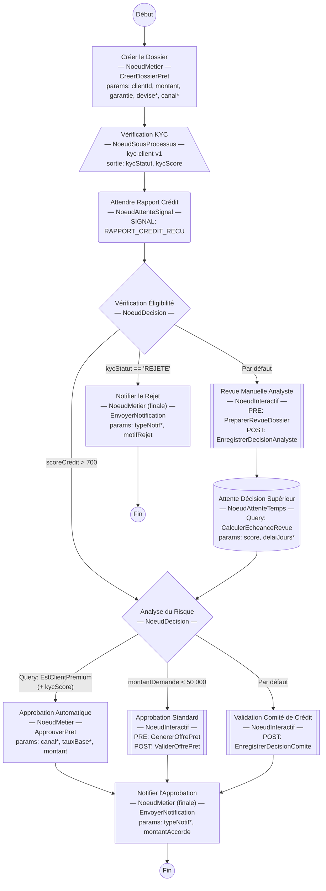
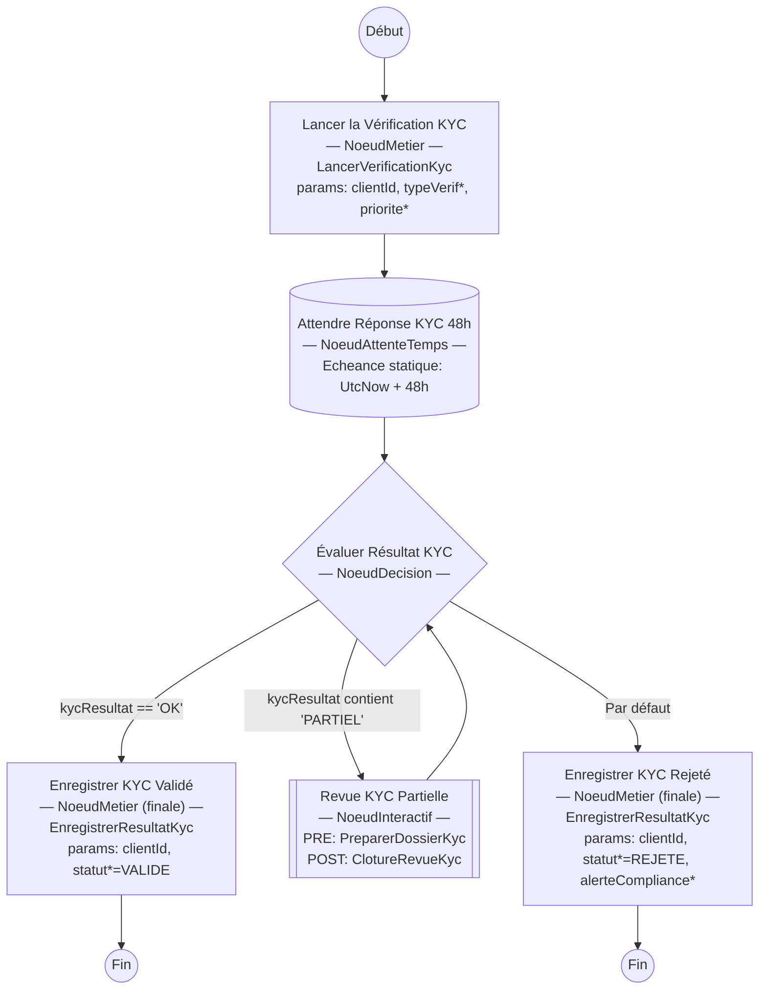

# Exemple de définition complexe — Demande de Prêt Immobilier

Cet exemple illustre tous les types de nœuds disponibles dans BpmPlus à travers un
processus de demande de prêt immobilier et son sous-processus de vérification KYC.

---

## Graphes

### Processus principal : `demande-pret`



> `*` = valeur statique — les autres paramètres sont lus depuis une variable de processus.

---

### Sous-processus : `kyc-client`



---

## Légende des formes

| Forme Mermaid    | Type de nœud          | Description                                      |
|------------------|-----------------------|--------------------------------------------------|
| Rectangle `[  ]` | `NoeudMetier`         | Exécute une commande domaine                     |
| Losange `{  }`   | `NoeudDecision`       | Branche selon conditions (variable ou query)     |
| Double-bord `[[ ]]` | `NoeudInteractif`  | Tâche humaine avec commandes PRE / POST          |
| Cylindre `[( )]` | `NoeudAttenteTemps`   | Suspend jusqu'à une échéance                     |
| Arrondi `(  )`   | `NoeudAttenteSignal`  | Suspend jusqu'à réception d'un signal externe    |
| Parallélogramme `[/ \]` | `NoeudSousProcessus` | Délègue à un processus enfant          |
| Cercle `(( ))`   | Début / Fin           | Points d'entrée et de sortie                     |

---

## Code C#

### Processus principal

```csharp
var processusLoan = new DefinitionProcessusBuilder(
        "demande-pret",
        "Demande de Prêt Immobilier",
        "creer-demande")

    // ── 1. NoeudMetier : création du dossier ──────────────────────────────
    .AjouterNoeudMetier("creer-demande", "Créer le Dossier", b => b
        .CommandeNommee("CreerDossierPret")
        .ParametreDepuisVariable("clientId",  "clientIdVar")
        .ParametreDepuisVariable("montant",   "montantDemande")
        .ParametreDepuisVariable("garantie",  "typeGarantie")
        .ParametreStatique("devise",          "EUR")
        .ParametreStatique("canal",           "WEB")
        .Vers("kyc-verification"))

    // ── 2. NoeudSousProcessus : vérification KYC ──────────────────────────
    .AjouterNoeudSousProcessus("kyc-verification", "Vérification KYC", b => b
        .DefinitionEnfant("kyc-client", 1)
        .SortiesVariables("kycStatut", "kycScore")
        .Vers("attendre-bureau-credit"))

    // ── 3. NoeudAttenteSignal : rapport du bureau de crédit ───────────────
    .AjouterNoeudAttenteSignal("attendre-bureau-credit", "Attendre Rapport Crédit", b => b
        .Signal("RAPPORT_CREDIT_RECU")
        .Vers("verification-eligibilite"))

    // ── 4. NoeudDecision : éligibilité — conditions variable + défaut ─────
    .AjouterNoeudDecision("verification-eligibilite", "Vérification Éligibilité", b => b
        .SiEgal("kycStatut", "REJETE")
            .Vers("notifier-rejet")
        .SiSuperieur("scoreCredit", 700)
            .Vers("analyse-risque")
        .ParDefaut()
            .Vers("revue-manuelle"))

    // ── 5. NoeudInteractif : revue manuelle — commandes PRE et POST ───────
    .AjouterNoeudInteractif("revue-manuelle", "Revue Manuelle Analyste", b => b
        .DefinirTache("Revue du dossier",
            "Analyser le dossier et renseigner la décision avant l'échéance.")
        .AvecCommandePre("PreparerRevueDossier", c => c
            .AggregateIdDepuisVariable("dossierIdVar")
            .ParametreDepuisVariable("scoreCredit", "scoreCredit")
            .ParametreStatique("priorite", "HAUTE"))
        .AvecCommandePost("EnregistrerDecisionAnalyste", c => c
            .AggregateIdDepuisVariable("dossierIdVar")
            .ParametreDepuisVariable("decision", "decisionAnalyste")
            .ParametreStatique("source", "ANALYSTE"))
        .Vers("attente-decision-superieur"))

    // ── 6. NoeudAttenteTemps : échéance calculée par query ────────────────
    .AjouterNoeudAttenteTemps("attente-decision-superieur", "Attente Décision Supérieur", b => b
        .EcheanceDepuisQuery("CalculerEcheanceRevue", "dossierIdVar")
        .ParametreQueryDepuisVariable("score", "scoreCredit")
        .ParametreQueryStatique("delaiJours", 5)
        .Vers("analyse-risque"))

    // ── 7. NoeudDecision : risque — query + conditions variable + défaut ──
    .AjouterNoeudDecision("analyse-risque", "Analyse du Risque", b => b
        .SiQuery("EstClientPremium", "clientIdVar")
            .ParametreQueryDepuisVariable("score", "kycScore")
            .Vers("approbation-rapide")
        .SiInferieur("montantDemande", 50_000)
            .Vers("approbation-standard")
        .ParDefaut()
            .Vers("approbation-comite"))

    // ── 8. NoeudMetier : approbation automatique ──────────────────────────
    .AjouterNoeudMetier("approbation-rapide", "Approbation Automatique", b => b
        .CommandeNommee("ApprouverPret", "dossierIdVar")
        .ParametreStatique("canal",    "AUTO")
        .ParametreStatique("tauxBase", 2.5)
        .ParametreDepuisVariable("montant", "montantDemande")
        .Vers("notifier-approbation"))

    // ── 9. NoeudInteractif : approbation standard ─────────────────────────
    .AjouterNoeudInteractif("approbation-standard", "Approbation Standard", b => b
        .DefinirTache("Valider l'offre de prêt",
            "Vérifier les conditions et signer l'offre.")
        .AvecCommandePre("GenererOffrePret", c => c
            .AggregateIdDepuisVariable("dossierIdVar")
            .ParametreDepuisVariable("montant", "montantDemande")
            .ParametreStatique("devise", "EUR"))
        .AvecCommandePost("ValiderOffrePret", "dossierIdVar")
        .Vers("notifier-approbation"))

    // ── 10. NoeudInteractif : validation comité ───────────────────────────
    .AjouterNoeudInteractif("approbation-comite", "Validation Comité de Crédit", b => b
        .DefinirTache("Présentation au Comité",
            "Soumettre le dossier au comité de crédit pour validation collégiale.")
        .AvecCommandePost("EnregistrerDecisionComite", c => c
            .AggregateIdDepuisVariable("dossierIdVar")
            .ParametreDepuisVariable("montant", "montantDemande")
            .ParametreStatique("seuil", 100_000))
        .Vers("notifier-approbation"))

    // ── 11. NoeudMetier finale : notification approbation ────────────────
    .AjouterNoeudMetier("notifier-approbation", "Notifier l'Approbation", b => b
        .CommandeNommee("EnvoyerNotification", "clientIdVar")
        .ParametreStatique("typeNotif", "APPROBATION")
        .ParametreDepuisVariable("montantAccorde", "montantDemande")
        .EstFinale())

    // ── 12. NoeudMetier finale : notification rejet ───────────────────────
    .AjouterNoeudMetier("notifier-rejet", "Notifier le Rejet", b => b
        .CommandeNommee("EnvoyerNotification", "clientIdVar")
        .ParametreStatique("typeNotif", "REJET")
        .ParametreDepuisVariable("motifRejet", "kycStatut")
        .EstFinale())

    .Construire();
```

---

### Sous-processus : `kyc-client`

```csharp
var processusKyc = new DefinitionProcessusBuilder(
        "kyc-client",
        "Vérification KYC Client",
        "lancer-kyc")

    // ── 1. NoeudMetier : déclenchement KYC ───────────────────────────────
    .AjouterNoeudMetier("lancer-kyc", "Lancer la Vérification KYC", b => b
        .CommandeNommee("LancerVerificationKyc")
        .ParametreDepuisVariable("clientId", "clientIdVar")
        .ParametreStatique("typeVerif", "COMPLET")
        .ParametreStatique("priorite",  1)
        .Vers("attendre-reponse-kyc"))

    // ── 2. NoeudAttenteTemps : délai statique de 48h ──────────────────────
    // Pour un délai relatif à l'heure de démarrage, préférer EcheanceDepuisQuery.
    .AjouterNoeudAttenteTemps("attendre-reponse-kyc", "Attendre Réponse KYC 48h", b => b
        .EcheanceStatique(DateTime.UtcNow.AddHours(48))
        .Vers("evaluer-kyc"))

    // ── 3. NoeudDecision : résultat KYC — Egal, Contient, défaut ─────────
    .AjouterNoeudDecision("evaluer-kyc", "Évaluer Résultat KYC", b => b
        .SiEgal("kycResultat", "OK")
            .Vers("enregistrer-kyc-ok")
        .SiContient("kycResultat", "PARTIEL")
            .Vers("revue-kyc-manuelle")
        .ParDefaut()
            .Vers("enregistrer-kyc-ko"))

    // ── 4. NoeudInteractif : revue manuelle pour résultat partiel ─────────
    .AjouterNoeudInteractif("revue-kyc-manuelle", "Revue KYC Partielle", b => b
        .DefinirTache("Vérification KYC manuelle",
            "Le résultat KYC est partiel, une vérification manuelle est requise.")
        .AvecCommandePre("PreparerDossierKyc", c => c
            .ParametreDepuisVariable("clientId", "clientIdVar")
            .ParametreStatique("mode", "MANUEL"))
        .AvecCommandePost("ClotureRevueKyc", c => c
            .ParametreDepuisVariable("clientId",  "clientIdVar")
            .ParametreDepuisVariable("decision",  "kycDecisionManuelle"))
        .Vers("evaluer-kyc"))

    // ── 5. NoeudMetier finale : KYC validé ───────────────────────────────
    .AjouterNoeudMetier("enregistrer-kyc-ok", "Enregistrer KYC Validé", b => b
        .CommandeNommee("EnregistrerResultatKyc")
        .ParametreDepuisVariable("clientId", "clientIdVar")
        .ParametreStatique("statut", "VALIDE")
        .EstFinale())

    // ── 6. NoeudMetier finale : KYC rejeté ───────────────────────────────
    .AjouterNoeudMetier("enregistrer-kyc-ko", "Enregistrer KYC Rejeté", b => b
        .CommandeNommee("EnregistrerResultatKyc")
        .ParametreDepuisVariable("clientId", "clientIdVar")
        .ParametreStatique("statut",          "REJETE")
        .ParametreStatique("alerteCompliance", true)
        .EstFinale())

    .Construire();
```

---

## Variables de processus impliquées

| Variable              | Sens       | Alimentée par                                      |
|-----------------------|------------|----------------------------------------------------|
| `clientIdVar`         | Entrée     | Démarrage de l'instance                            |
| `montantDemande`      | Entrée     | Démarrage de l'instance                            |
| `typeGarantie`        | Entrée     | Démarrage de l'instance                            |
| `dossierIdVar`        | Interne    | Handler de `CreerDossierPret` via le contexte      |
| `scoreCredit`         | Interne    | Handler du signal `RAPPORT_CREDIT_RECU`            |
| `decisionAnalyste`    | Interne    | Formulaire de la tâche interactive                 |
| `kycStatut`           | Sortie SP  | Sous-processus `kyc-client` (`VariablesSorties`)   |
| `kycScore`            | Sortie SP  | Sous-processus `kyc-client` (`VariablesSorties`)   |
| `kycResultat`         | Interne SP | Handler de `LancerVerificationKyc`                 |
| `kycDecisionManuelle` | Interne SP | Formulaire de la tâche interactive KYC partielle   |
